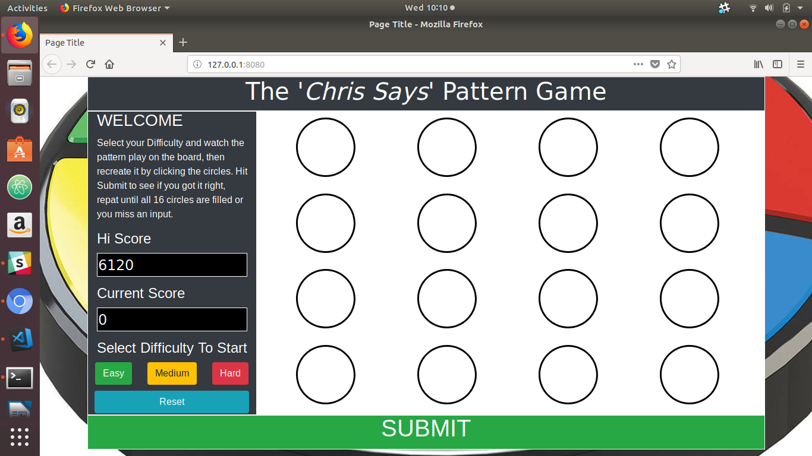
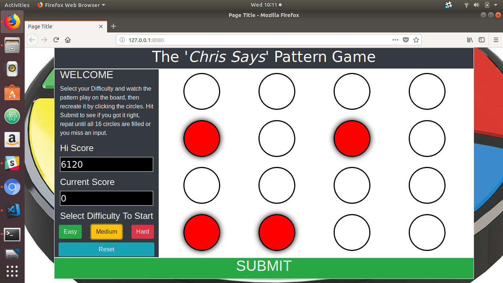
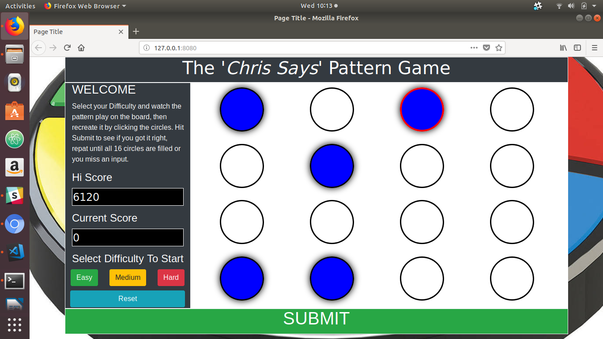
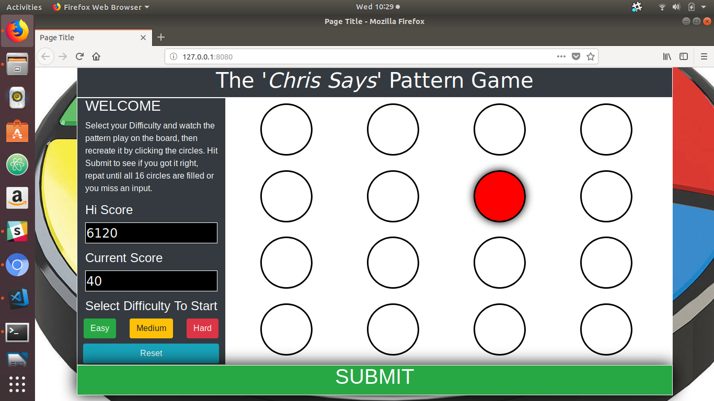

# Galvanize-Q1-Project-Chris-Says
Galvanize Q1 project covering front-end Development.
Project Description:
Welcome to Chris Says, a browser-variant of the class 80s electronic game Simon Says. This is a pattern-matching game in which players must replicate a sequence of flashing circles on the screen. The more you get right the longer the sequence grows the more points you get. See if you can get the high score or complete a whole 16-button sequence. This project was created as part of my Galvanize Web Development education, it was built in 3-days after just under 1-month at the school for my Q1 project to demonstrate my mastery of front-end development. I came up with the idea because I wanted to make something I could play with my 4-year-old son who can't read yet.

Installation Instructions:
fork and clone the games' repo from Github. Chris Says does not make use of any major node plugins or packages to function but for development purposes please run 'npm install' after downloading as this program does make use of the folling for development purposes: live-server, watchify, browserify, run-all.

link: http://chris-says.surge.sh/ 

Gameplay Instructions:
1. Upon loading up the game in the browser, select one of the three difficulty options in the left-hand menu bar.

2. 1.5 seconds after clicking the game will begin and your first pattern will begin to play across the screen as seen below. Each button will flash Red.

3. After the sequence finishes move your cursor, or use your finger, and tap the buttons to replicate the pattern. You're inputs will turn Blue, once your finished click submit at the bottom of the page.

4. If you replicated the pattern successfully your score will be updated in the Current Score Window and the game will continue. 

5. After 1.5 seconds the game will continue. the original sequence will flash on screen again only now one additional circle will flash red. Keep replicating the pattern until either all 16 circles are filled in or you make a mistake.

6. If ever you submit an incorrect pattern the Submit bar will flash "Sorry, Try Again". At this point your game is over and the program will reset. At which point you can try again by selecting a difficulty again.